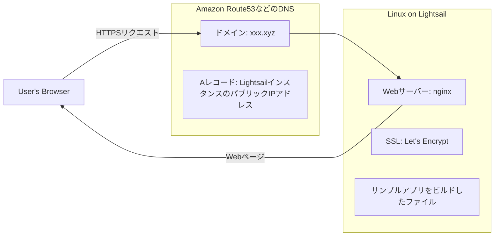
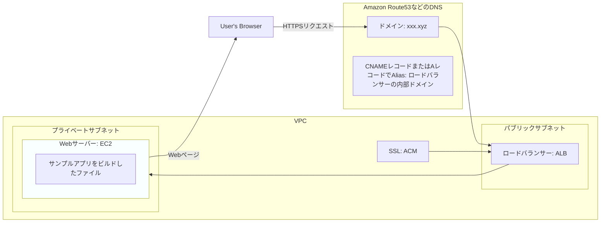

# SPAをインターネットに公開する

データベース等を持たない、フロントエンドのみで完結するアプリケーションをインターネットに公開する手順の紹介。  
サンプルアプリケーションは [Next.jsの公式サンプルブログアプリ](https://github.com/vercel/next.js/tree/canary/examples/blog-starter) を利用する。  
`sample-app/` 以下は

```bash
npx create-next-app --example blog-starter sample-app
```

でダウンロードしたファイル群で、 `sample-app/_posts/` 以下にMarkdown形式で書いたドキュメントをWebで表示可能にするというもの。

## サンプルアプリをローカルマシンで起動する方法

```bash
cd sample-app
npm i
npm run dev
```

http://localhost:3000 で開発サーバーが起動し、ブラウザで確認が可能。

### Knowledge

上記のサンプルアプリはSSRになっているため、SSG化するように以下の変更をおこなっている。  
https://github.com/sora-corporation/web-app-deploy-basic/commit/9e71440e75d9f53e411322cfba13c577d09c7af5

- SSR
    - サーバーサイドのWebアプリケーションがHTMLを返す方式
- SSG
    - 静的はHTML, CSS, JavaScriptを事前に生成する方式

以下のコマンドで静的ファイルが `sample-app/out/` 以下に生成される。  
このディレクトリ以下のファイルをホスティングサーバーにアップロードすれば、サンプルアプリをインターネット公開することができる。

```bash
cd sample-app
npm run build
```

## サンプルアプリを1台のサーバーにデプロイする

- WebサーバーをLightsail(VPS)上に構築
- サンプルアプリをビルドしたファイルをWebサーバー上に配置
- Webサーバーにはnginxを利用
- Let's Encryptを利用してSSL証明書を取得
- LightsailインスタンスのIPアドレスをRoute53(DNS)に設定



### 手順

1. AWS管理コンソールから、Lightsailインスタンスを起動
    - OS Only, Ubuntu 24.04 LTSを選択する 
    - `Networking` > `IPv4 Firewall` からHTTPSを許可する
    - `Networking` > `IPv4 Firewall` からSSHの接続元を制限する
    - 長期利用する場合は `Networking` から `Attach static IP` を押し、再起動してもIPアドレスが変わらないようにする
    - SSHクライアントの設定をおこない、接続が可能か確認する
1. nginxのインストール
    - `sudo apt update`
    - `sudo apt upgrade`
    - `sudo apt install nginx`
    - ブラウザからサーバーのIPアドレスにアクセスし、nginxのデフォルトページが表示されることを確認する
1. ドメインの設定
    - DNSのAレコードにLightsailインスタンスのパブリックIPを登録する
    - 少し時間をおいて、 `http://[ドメイン名]` でnginxのデフォルトページが表示されることを確認する
1. certbotのインストールとSSL証明書の取得
    - `sudo apt install certbot`
    - `sudo certbot certonly -d [設定するドメイン名]`
        - `Runs an HTTP server locally...` の方を選択
        - 途中で80番ポートが既に使用されていると言われた場合は一度nginxを停止する
            - `sudo systemctl stop nginx`
        - 証明書の発行が完了すると出力先が表示されるので、これをメモしておく
1. nginxのSSL設定とアプリケーションの配置
    - 上記でメモしたSSL情報をnginxの設定ファイル `/etc/nginx/sites-available/default` に追加する
    - `sudo mkdir /var/www/web-app-deploy-basic`
    - `sudo chown ubuntu:ubuntu /var/www/web-app-deploy-basic`
    - ローカルでビルドしたサンプルアプリをサーバーにコピー
        - `rsync -ahv --delete ./sample-app/out/ [サーバーのIPアドレス]:/var/www/web-app-deploy-basic/`
    - nginxを再起動する
        - `sudo systemctl restart nginx`
    - `https://[ドメイン名]` にアクセスし、HTTPSでサンプルアプリケーションが表示されることを確認する

#### nginxの設定ファイルのサンプル

```
server {
  listen 80;
  server_name [ドメイン名];
  return 301 https://$http_host$request_uri;
}

server {
  listen 443 ssl;
  server_name [ドメイン名];
  root  /var/www/web-app-deploy-basic;
  index index.html;
  allow all;
  deny all;

  ssl on;
  ssl_certificate     /etc/letsencrypt/live/[ドメイン名]/fullchain.pem;
  ssl_certificate_key /etc/letsencrypt/live/[ドメイン名]/privkey.pem;
}
```

## サンプルアプリをVPC内のEC2インスタンスにデプロイする

- パブリックサブネットとプライベートサブネットを分離したVPCを構築
- プライベートサブネット内にEC2インスタンスを起動し、これをWebサーバーとする
- サンプルアプリをビルドしたファイルをWebサーバー上に配置
- Webサーバーは80番ポートでVPC内に公開
- パブリックサブネット内にロードバランサーを配置し、Webサーバーを紐づけ
- SSL証明書はAWS Certificate Manager(ACM)で作成し、ロードバランサーに紐づけ
- ロードバランサーのドメインをRoute53(DNS)に設定



### 手順

1. AWSリソースをTerraformを使って構築する。実行手順詳細は [README](./infra/terraform/README.md) を参照。
1. 踏み台EC2インスタンス経由でプライベートサブネット内のEC2インスタンスにSSH接続できることを確認する
    - SSH設定例は下記参照
1. nginxのインストールとアプリケーションの配置
    - `sudo apt update`
    - `sudo apt upgrade`
    - `sudo apt install nginx`
    - `sudo chown ubuntu:ubuntu /var/www/html`
    - nginxはSSL設定が必要ないので、デフォルト設定のままで動く
    - ローカルでビルドしたサンプルアプリをサーバーにコピー
        - `rsync -ahv --delete ./sample-app/out/ [Webサーバーの接続先]:/var/www/html/`
    - `https://sub.[ドメイン名]` にアクセスし、HTTPSでサンプルアプリケーションが表示されることを確認する

#### SSH設定例

```
Host wadb.bastion
  HostName [踏み台サーバーに貼られたElastic IPアドレス]
  User ubuntu
  IdentityFile ~/.ssh/[SSH秘密鍵]
  PubkeyAuthentication yes
  PasswordAuthentication no
  ServerAliveInterval 30

Host wadb.app
  HostName [Webサーバー用インスタンスのプライベートIPアドレス]
  User ubuntu
  ServerAliveInterval 30
  IdentityFile ~/.ssh/[SSH秘密鍵]
  ProxyCommand ssh -CW %h:%p wadb.bastion
```