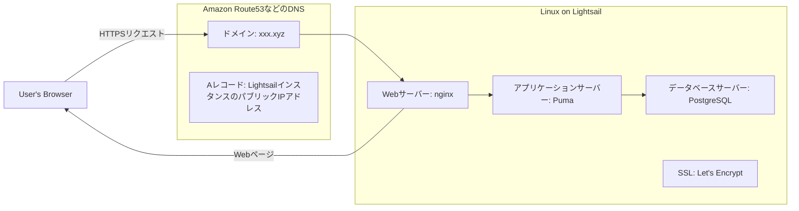
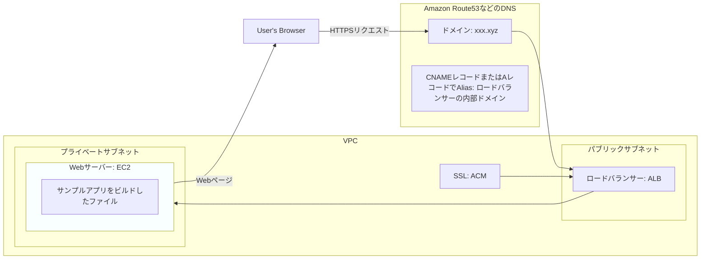
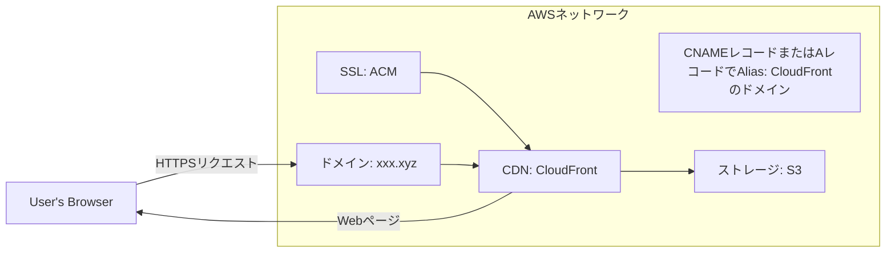

# Web APIのサンプルをインターネットに公開する

データベースを持ち、シンプルなデータのCRUD（登録/参照/更新/削除）をおこなうWeb APIを提供するアプリケーションをインターネットに公開する手順の紹介。  
サンプルアプリケーションは [Ruby on Rails](https://railsguides.jp/install_ruby_on_rails.html) を利用する。  

## サンプルアプリをローカルマシンで起動する方法

[サンプルアプリのREADME](./sample-app/README.md) を参照。

## サンプルアプリを1台のサーバーにデプロイする

- Lightsail(VPS)上に以下を構築
    - Webサーバー（nginx）
    - アプリケーションサーバー（Puma）
- Lightsailのデータベースインスタンス機能でデータベース（PostgreSQL）サーバーを構築
- サンプルアプリをアプリケーションサーバーで実行し、Webサーバーのリバースプロキシ機能を使ってHTTPSポートで公開
- Let's Encryptを利用してSSL証明書を取得
- LightsailインスタンスのIPアドレスをRoute53(DNS)に設定



### 手順

1. AWS管理コンソールから、Lightsailインスタンスを起動
    - OS Only, Ubuntu 24.04 LTSを選択する 
    - `Networking` > `IPv4 Firewall` からHTTPSを許可する
    - `Networking` > `IPv4 Firewall` からSSHの接続元を制限する
    - 長期利用する場合は `Networking` から `Attach static IP` を押し、再起動してもIPアドレスが変わらないようにする
    - SSHクライアントの設定をおこない、接続が可能か確認する
1. Lightsail管理コンソール > Databases > Create database から、データベースインスタンスを起動
    - PostgreSQLの最新バージョンを選択し、接続情報や初期DBを指定する
    - 起動したら `Networking` から `Public mode` をONにする
    - ローカルマシンのDBクライアントツールなどからデータベースに接続できることを確認する
1. Ansibleの実行
    - [Ansible のREADME参照](./infra/playbook/README.md)
1. Railsアプリケーションのデプロイ
    - [デプロイ用のREADMEを参照](./sample-app/deploy/README.md)
1. ドメインの設定
    - DNSのAレコードにLightsailインスタンスのパブリックIPを登録する
    - 少し時間をおいて、 `http://[ドメイン名]/up` でRailsアプリケーションが返す画面が表示されることを確認する
1. SSL証明書の発行以降は `01_static` と同じなので省略

### Knowledges

[Ansible](https://docs.ansible.com/) とは、Red Hatがメンテナンスするオープンソースの構成管理ツール。

#### nginxの設定ファイルのサンプル

```
server {
  listen 80;
  server_name [ドメイン名];
  return 301 https://$http_host$request_uri;
}

server {
  listen 443 ssl;
  server_name [ドメイン名];
  root  /var/www/web-app-deploy-basic;
  index index.html;
  allow all;
  deny all;

  ssl on;
  ssl_certificate     /etc/letsencrypt/live/[ドメイン名]/fullchain.pem;
  ssl_certificate_key /etc/letsencrypt/live/[ドメイン名]/privkey.pem;
}
```

## サンプルアプリをVPC内のEC2インスタンスにデプロイする

- パブリックサブネットとプライベートサブネットを分離したVPCを構築
- プライベートサブネット内にEC2インスタンスを起動し、これをWebサーバーとする
- サンプルアプリをビルドしたファイルをWebサーバー上に配置
- Webサーバーは80番ポートでVPC内に公開
- パブリックサブネット内にロードバランサーを配置し、Webサーバーを紐づけ
- SSL証明書はAWS Certificate Manager(ACM)で作成し、ロードバランサーに紐づけ
- ロードバランサーのドメインをRoute53(DNS)に設定



### 手順

1. AWSリソースをTerraformを使って構築する。実行手順詳細は [README](./infra/terraform/README.md) を参照。
1. 踏み台EC2インスタンス経由でプライベートサブネット内のEC2インスタンスにSSH接続できることを確認する
    - SSH設定例は下記参照
1. nginxのインストールとアプリケーションの配置
    - `sudo apt update`
    - `sudo apt upgrade`
    - `sudo apt install nginx`
    - `sudo chown ubuntu:ubuntu /var/www/html`
    - nginxはSSL設定が必要ないので、デフォルト設定のままで動く
    - ローカルでビルドしたサンプルアプリをサーバーにコピー
        - `rsync -ahv --delete ./sample-app/out/ [Webサーバーの接続先]:/var/www/html/`
    - `https://sub.[ドメイン名]` にアクセスし、HTTPSでサンプルアプリケーションが表示されることを確認する

#### SSH設定例

```
Host wadb.bastion
  HostName [踏み台サーバーに貼られたElastic IPアドレス]
  User ubuntu
  IdentityFile ~/.ssh/[SSH秘密鍵]
  PubkeyAuthentication yes
  PasswordAuthentication no
  ServerAliveInterval 30

Host wadb.app
  HostName [Webサーバー用インスタンスのプライベートIPアドレス]
  User ubuntu
  ServerAliveInterval 30
  IdentityFile ~/.ssh/[SSH秘密鍵]
  ProxyCommand ssh -CW %h:%p wadb.bastion
```

## サンプルアプリをS3バケット + CDNで公開する

- S3バケットを作成し、サンプルアプリをビルドしたファイルをアップロード
- CloudFront(CDN)を配置し、originをS3バケットに設定
- SSL証明書はAWS Certificate Manager(ACM)で作成し、CloudFrontに紐づけ
- CloudFrontのドメインをRoute53(DNS)に設定



### 手順

1. AWSリソースをTerraformを使って構築する。実行手順詳細は [README](./infra/terraform/README.md) を参照。
1. ローカルでビルドしたサンプルアプリをS3バケットにアップロード
    - `https://cdn.[ドメイン名]` にアクセスし、HTTPSでサンプルアプリケーションが表示されることを確認する

## サンプルアプリをAmplifyで公開する

- Amplifyプロジェクトを作成
    - IaC, CI/CDが一体化されているため、GitHubプロジェクトを紐づければ自動的に構築される
    - アプリケーションを更新する場合も、GitHubのリポジトリにPushすれば自動的に更新される
- AmplifyのドメインをRoute53(DNS)に設定
- 構成図としてはS3 + CloudFrontと同じだが、Amplifyの裏側にあり直接リソースを参照することはできない

### 手順

1. AWS管理コンソールからAmplifyの新規プロジェクトを作成
    - GitHubプロジェクトを選択するとコードを読み取って構成が提案されるので、基本的にそれに従っておけば良い
    - `amplify.yml` は下記のように設定
1. ドメインの設定
    - Amplifyプロジェクトの設定 > ホスティング > カスタムドメイン > ドメインの追加 からおこなう
    - DNSにRoute53を利用していると、SSL証明書の設定までこの中で完結することができる
1. ローカルでビルドしたサンプルアプリをS3バケットにアップロード
    - `https://amplify.[ドメイン名]` にアクセスし、HTTPSでサンプルアプリケーションが表示されることを確認する

#### amplify.yml

```yml
version: 1
frontend:
    phases:
        build:
            commands:
                - cd 01_static/sample-app
                - nvm install 22
                - nvm use 22
                - npm i
                - npm run build
    artifacts:
        baseDirectory: '01_static/sample-app/out'
        files:
            - '**/*'
    cache:
        paths: []
```