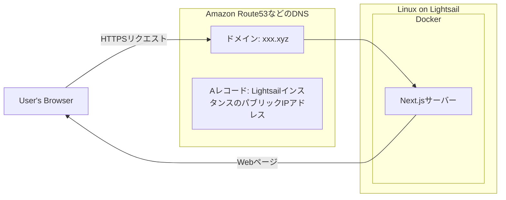
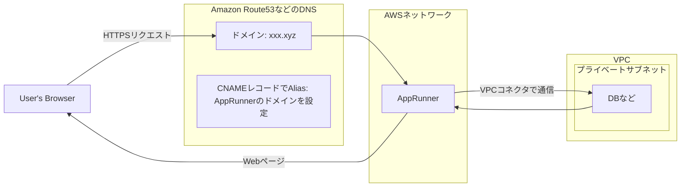

# コンテナを使って公開する

[01_static](../01_static/README.md) の Next.js アプリケーションをコンテナを使って公開する手順の紹介。

## サンプルアプリを 1 台のサーバーにデプロイする

開発環境やPoCなど、特定のユーザー向けに公開するような場合はこの方法が手っ取り早い。

- サンプルアプリをビルドしたファイルをDockerコンテナ化
  - Next.jsのサーバーを起動し、SSRでHTMLを描画する
- Lightsail(VPS)上にDockerをインストール
- Dockerコンテナを起動
- Lightsailの機能を使い、ロードバランサーとSSL証明書をアタッチ
- LightsailインスタンスのIPアドレスをRoute53(DNS)に設定



### 手順

1. アプリケーションのコンテナ化
    - https://github.com/vercel/next.js/tree/canary/examples/with-docker#in-existing-projects
    - `Dockerfile`, `compose.yaml` を参照
    - `docker compose up` 後、 `http://localhost` でサンプルアプリが閲覧できればOK
1. AWS 管理コンソールから、Lightsail インスタンスを起動
    - OS Only, Ubuntu 24.04 LTS を選択する
    - `Networking` > `IPv4 Firewall` からHTTPSを許可する
    - `Networking` > `IPv4 Firewall` からSSHの接続元を制限する
    - 長期利用する場合は `Networking` から `Attach static IP` を押し、再起動してもIPアドレスが変わらないようにする
    - SSHクライアントの設定をおこない、接続が可能か確認する
1. Dockerのインストール
    - https://docs.docker.com/engine/install/ubuntu/
    ```
    sudo apt update
    sudo apt upgrade
    for pkg in docker.io docker-doc docker-compose docker-compose-v2 podman-docker containerd runc; do sudo apt-get remove $pkg; done
    sudo apt install ca-certificates curl
    sudo install -m 0755 -d /etc/apt/keyrings
    sudo curl -fsSL https://download.docker.com/linux/ubuntu/gpg -o /etc/apt/keyrings/docker.asc
    sudo chmod a+r /etc/apt/keyrings/docker.asc
    echo \
      "deb [arch=$(dpkg --print-architecture) signed-by=/etc/apt/keyrings/docker.asc] https://download.docker.com/linux/ubuntu \
      $(. /etc/os-release && echo "${UBUNTU_CODENAME:-$VERSION_CODENAME}") stable" | \
      sudo tee /etc/apt/sources.list.d/docker.list > /dev/null
    sudo apt-get update
    sudo apt-get install docker-ce docker-ce-cli containerd.io docker-buildx-plugin docker-compose-plugin
    ```
    - `sudo docker run hello-world` を実行して動作確認
1. アプリケーションの起動
    ```
    ssh xxx.xxx -A
    git clone git@github.com:sora-corporation/web-app-deploy-basic.git
    cd web-app-deploy-basic/03_container/sample-app
    sudo docker compose up -d
    ```
1. ドメインの設定
    - DNS の A レコードに Lightsail インスタンスのパブリック IP を登録する
    - 少し時間をおいて、 `http://[ドメイン名]` で サンプルアプリケーションが表示されることを確認する
    - 確認できたら DNS の設定は戻しておく（次のステップで設定するため）
1. ロードバランサーとSSL証明書の設定
    - Lightsailの管理画面 > Networking > Load balancer からロードバランサーを作成
        - `Target instances` にDockerを動かしているインスタンスを選択してAttach
        - Custom domains > `Create certificate` から証明書を作成。有効になったら `Attach`
        - Networking > `HTTP to HTTPS redirection is inactive` をON
    - DNSのCNAMEレコードに、ロードバランサーの `Default domain` を追加
    - `https://[ドメイン名]` にアクセスし、HTTPSでサンプルアプリケーションが表示されることを確認する

## サンプルアプリを AppRunner で動かす

任意のコンテナイメージをフルマネージドで動かせるサービス。Amplifyのコンテナ版のような立ち位置。  
DBやキャッシュサーバーなどVPC内のリソースにアクセスしたい場合は、「VPCコネクタ」を作成することで通信可能になる。

- パブリックサブネットとプライベートサブネットを分離したVPCを構築
- プライベートサブネット内のリソースにアクセス可能なVPCコネクタを作成
- AppRunnerを使ってサンプルアプリをデプロイ
- AppRunnerのドメインを Route53(DNS)のCNAMEレコードに設定



### 手順

1. AWS リソースを Terraform を使って構築する。実行手順詳細は [README](./infra/terraform/README.md) を参照。
1. ECRにイメージをプッシュ
    ```
    cd web-app-deploy-basic/03_container/sample-app
    export AWS_DEFAULT_PROFILE=web-app-deploy-basic
    aws ecr get-login-password --region ap-northeast-1 | docker login --username AWS --password-stdin [AWSアカウントID].dkr.ecr.ap-northeast-1.amazonaws.com
    docker build --platform linux/amd64 -t web-app-deploy-basic-development .
    docker tag web-app-deploy-basic-development:latest [AWSアカウントID].dkr.ecr.ap-northeast-1.amazonaws.com/web-app-deploy-basic-development:latest
    docker push [AWSアカウントID].dkr.ecr.ap-northeast-1.amazonaws.com/web-app-deploy-basic-development:latest
    ```
1. `https://[ドメイン名]` にアクセスし、HTTPS でサンプルアプリケーションが表示されることを確認する

## サンプルアプリをFargate(ECS)で公開する

- 本格的なアプリケーションを公開する場合に利用する
- 「サービス」「タスク」など、独自の概念を理解する必要があり運用難易度は高い
- 構築は [CDK](https://aws.amazon.com/jp/cdk/) を利用すると楽
    - `Dockerfile` を指定し、ECR（コンテナイメージ用のリポジトリ）の作成からタスク定義までを簡単に書くことができる
    - 例
        ```ts
        const cluster = new ecs.Cluster(this, 'sample-app-cluster', {vpc});
        const task = new ecs.FargateTaskDefinition(this, 'sample-app-task', {
            executionRole,
            taskRole,
            cpu: 1024,
            memoryLimitMiB: 2048,
        });
        const repo = new DockerImageAsset(this, 'sample-app-image', {
            directory: path.join(__dirname, '../../'),
            file: 'Dockerfile',
        });
        task.addContainer('sample-app-container', {
            image: ecs.ContainerImage.fromDockerImageAsset(repo),
            command: ['node', 'server.js'],
            environment: {
            },
            logging: ecs.LogDriver.awsLogs({
                streamPrefix: 'sample-app',
            }),
        });
        new ecs.FargateService(this, 'sample-app-service', {
            cluster,
            vpcSubnets: {
                subnetType: ec2.SubnetType.PRIVATE_WITH_EGRESS,
            },
            taskDefinition: task,
            desiredCount: 1,
            assignPublicIp: true,
            propagateTags: ecs.PropagatedTagSource.TASK_DEFINITION,
        });
        ```